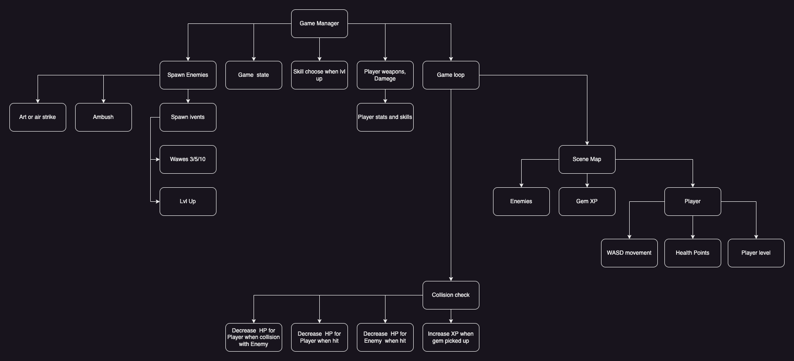
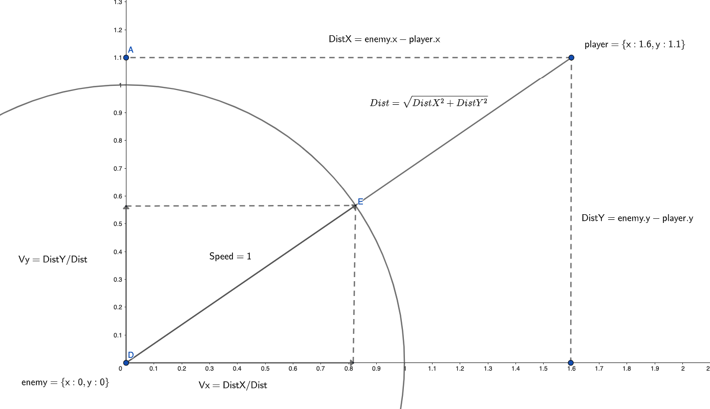

# Ukraine survival game

Survival game about Ukraine defense against russians invader orcs 2022 war

## Module dependency graph (autogenerated)

You can generate graph with:
```
npx madge --image graph.svg app.js
```
(GraphViz has to be installed on your PC)


[View image in full screen](https://gehinom.github.io/ukraine-survival-game/graph.svg)

## Diagrams

### Architecture Design Plan


[View/Edit image in full screen](https://drive.google.com/file/d/1A4ky3xO43eAG6_D2c-_BjhCF8kfpck7a/view?usp=sharing)

### Enemy moving towards player - Velocity direction


[Edit this diagram with Geogebra](https://www.geogebra.org/geometry/suqetgsw)
